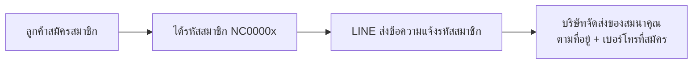

---
tags:
  - project-newclear
  - flow
  - register
  - gift
  - line-oa
created: 2026-08-07
---

# Flow: สมัครสมาชิก + แจกของสมนาคุณ 🎁

> Flow ตามที่คุณเบิร์ดกำหนด 2026-08-07 — เชื่อม LINE OA → สมัครสมาชิก → จัดส่งของ
> ⚠️ **Google Form ถูกยกเลิก (2026-08-07)** — LINE push ไม่แนบลิงก์ Google Form แล้ว (revert commit `cc1f252`)

## Flow (ลำดับ)

### ขั้นตอน
1. **สมัครสมาชิก** — ลูกค้าสมัครผ่าน LINE/เว็บ → ระบบสร้างรหัสสมาชิก `NC0000x` (มีแล้ว: `generateCustomerCode()` + T86 push welcome)
2. **LINE แจ้ง** — หลังสมัครสำเร็จ LINE push ข้อความแจ้งรหัสสมาชิก (ไม่มีลิงก์ Google Form แล้ว)
3. **จัดส่งของสมนาคุณ** — บริษัทใช้ **ที่อยู่ + เบอร์โทร** จากข้อมูลสมัครสมาชิก (ในระบบ) เป็นที่จัดส่ง

## สถานะปัจจุบัน (โค้ด)
- ✅ มี: LINE push ข้อความแจ้งรหัสสมาชิกหลังสมัคร (`customer.controller.ts` → `lineService.pushMessage`)
- ❌ ~~ลิงก์ Google Form ในข้อความ push~~ — ยกเลิกแล้ว (user ขอเอาออก 2026-08-07)

## ประเด็นที่ต้องตัดสินใจ
- ข้อมูล "ลูกค้าปลูกพืชอะไร" ยังไม่มีช่องทางเก็บ — ถ้าอยากได้ต้องออกแบบใหม่ (ฟอร์มในแอป หรือให้แจ้งเจ้าหน้าที่)
- สถานะ "ส่งของแล้ว/ยัง" ต้องมี tracking ไหม? (จะได้รู้ว่าใครยังไม่ได้ของ)

## Tasks ที่เกี่ยวข้อง
- [[Phase 1 Tasks]] — T140 (เบอร์ห้ามซ้ำ), T141 (ข้อความแจ้งที่อยู่/เบอร์ใช้จัดส่ง) — สนับสนุน flow นี้ตรงๆ (ข้อมูลจัดส่งต้องถูกต้อง)
