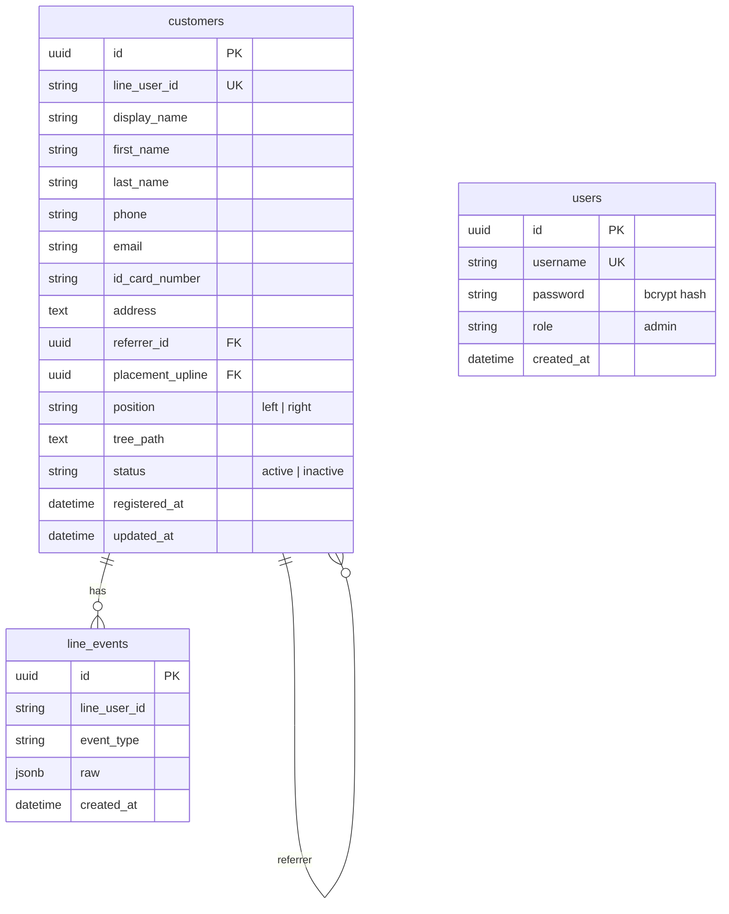

---
tags:
  - project-newclear
  - database
  - schema
  - mlm
created: 2026-07-21
---

# Database Schema

> PostgreSQL — ออกแบบเผื่อ MLM tree structure

## Entity Relationship



## SQL Schemas

### `users` — Dashboard Users (5 คน)

```sql
CREATE TABLE users (
  id          UUID PRIMARY KEY DEFAULT gen_random_uuid(),
  username    VARCHAR(50) UNIQUE NOT NULL,
  password    VARCHAR(255) NOT NULL,          -- bcrypt hash
  role        VARCHAR(20) DEFAULT 'admin',
  created_at  TIMESTAMPTZ DEFAULT NOW()
);
```

### `customers` — ลูกค้า (ออกแบบเผื่อ MLM)

```sql
CREATE TABLE customers (
  id              UUID PRIMARY KEY DEFAULT gen_random_uuid(),
  line_user_id    VARCHAR(255) UNIQUE,
  display_name    VARCHAR(255),

  -- ข้อมูลส่วนตัว
  first_name      VARCHAR(100),
  last_name       VARCHAR(100),
  phone           VARCHAR(20),
  email           VARCHAR(255),
  id_card_number  VARCHAR(20),                -- สำหรับ verify ตอน MLM
  address         TEXT,

  -- MLM Structure
  referrer_id      UUID REFERENCES customers(id),  -- คนชวน (who refer)
  placement_upline UUID REFERENCES customers(id), -- ตำแหน่งใน tree
  position         VARCHAR(10) CHECK (position IN ('left', 'right')),
  tree_path        TEXT,                         -- materialized path

  status          VARCHAR(20) DEFAULT 'active',
  registered_at   TIMESTAMPTZ DEFAULT NOW(),
  updated_at      TIMESTAMPTZ DEFAULT NOW()
);

-- Indexes
CREATE INDEX idx_customers_line_user_id ON customers(line_user_id);
CREATE INDEX idx_customers_referrer ON customers(referrer_id);
CREATE INDEX idx_customers_upline ON customers(placement_upline);
CREATE INDEX idx_customers_tree_path ON customers(tree_path);
```

### `line_events` — Log Event เผื่อ Debug

```sql
CREATE TABLE line_events (
  id          UUID PRIMARY KEY DEFAULT gen_random_uuid(),
  line_user_id VARCHAR(255),
  event_type  VARCHAR(50),
  raw         JSONB,
  created_at  TIMESTAMPTZ DEFAULT NOW()
);

CREATE INDEX idx_line_events_user ON line_events(line_user_id);
```

## MLM Tree Structure

### Materialized Path

ใช้ `tree_path` เก็บ path แบบ `/root/left/right/left` เพื่อให้ query ง่าย

- **หา downline ทั้งหมด:** `WHERE tree_path LIKE '/root/left/%'`
- **หาคนที่อยู่ลึกเท่าไหร่:** นับจำนวน `/` ใน tree_path
- **หาคนชวน (referrer):** `referrer_id` column

### Binary Tree (Binary MLM)

| Field | Usage |
|-------|-------|
| `referrer_id` | คนที่ชวนมา |
| `placement_upline` | คนที่อยู่เหนือใน tree (อาจต่างจาก referrer) |
| `position` | `left` หรือ `right` |
| `tree_path` | เก็บ path สำหรับ query ได้ง่าย |

> 💡 **Tip:** ใช้ `ltree` extension ของ PostgreSQL หรือเก็บเป็น materialized path string ก็พอสำหรับ 200 คน
