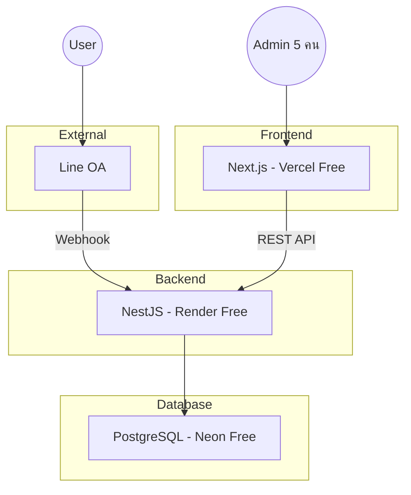

---
tags:
  - project-newclear
  - system-design
  - line-oa
  - mlm
created: 2026-07-21
---

# System Design: Line OA + MLM Platform

> โปรเจค Line OA สำหรับสั่งซื้อสินค้า + สมัครสมาชิก + Dashboard + ระบบ MLM

## สถาปัตยกรรม



## Tech Stack

| Component | Technology | Hosting |
|-----------|-----------|---------|
| Frontend | Next.js + **[[Astryx Design System]]** | Vercel Free Tier |
| Backend | NestJS | Render Free Tier |
| Database | PostgreSQL | Neon Free Tier |
| Messaging | Line Messaging API | Free |
| Auth | JWT | — |

## Cost Phase 1: **$0/เดือน** ✅

| Service | Free Tier |
|---------|-----------|
| Vercel | 100GB bandwidth, 6000 build min |
| Render | 512MB RAM, 1 CPU (sleeps on idle) |
| Neon | 0.5GB storage, 100h compute/mo |
| Line OA | ฟรี |
| Domain | `*.vercel.app` ฟรี |

## Components

### 1. Line OA
- [[Rich Menu]] ผ่าน Line Messaging API
- Webhook → NestJS
- Actions: postback (สั่งซื้อสินค้า), uri (สมัครสมาชิก)

### 2. Next.js (Frontend) — powered by [[Astryx Design System]]
- `/register` — ฟอร์มสมัครสมาชิก (public)
- `/login` — สำหรับ dashboard users
- `/dashboard` — รายชื่อ + รายละเอียดลูกค้า (ต้อง login)
- **UI Components:** Astryx 160+ React components (table, form, badge, modal, button)
- **Themes:** ปรับ brand colors ได้ผ่าน Astryx theme system
- **Dark mode:** Built-in

### 3. NestJS (Backend)
- `LineModule` — รับ webhook, จัดการ Rich Menu
- `CustomerModule` — CRUD ลูกค้า
- `AuthModule` — JWT login

### 4. PostgreSQL
- [[Database Schema]] — ออกแบบเผื่อ MLM tree structure

## Data Flow

### สมัครสมาชิก
```
User → Rich Menu "สมัครสมาชิก" → URI action
     → /register?lineUserId=xxx
     → กรอกฟอร์ม → POST /api/customers
     → NestJS → DB → redirect success
     → Push API: "สมัครสำเร็จ 🎉"
```

### Dashboard
```
Admin → /login → JWT
     → GET /api/customers (Bearer)
     → ตารางรายชื่อ + search/filter
     → คลิกดู detail
```

## ดูเพิ่มเติม
- [[Rich Menu]] — Layout และ Action
- [[Database Schema]] — Table design เผื่อ MLM
- [[Phase 1 Plan]] — ขั้นตอน implementation
