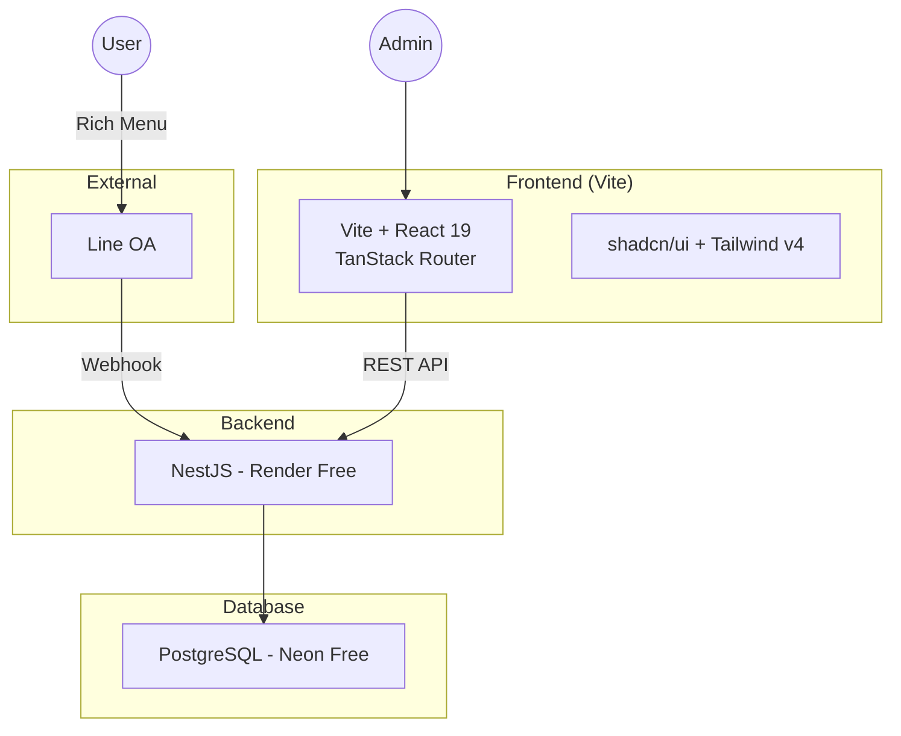

---
tags:
  - project-newclear
  - system-design
  - line-oa
  - mlm
  - kaset-nuclear
created: 2026-07-21
updated: 2026-07-28
---

# System Design: Line OA + MLM Platform — เกษตรนิวเคลียร์ 🌿

> ระบบบริหารสมาชิกและเครือข่าย MLM สำหรับ **เกษตรนิวเคลียร์** (วัสดุปรับปรุงดิน)
> ผ่าน LINE Official Account + Dashboard Admin

---

## สถาปัตยกรรม



## Tech Stack

| Component | Technology | Hosting |
|-----------|-----------|---------|
| Frontend | Vite + React 19 + TanStack Router + shadcn/ui | Vercel Free Tier |
| Backend | NestJS + Prisma ORM | Render Free Tier |
| Database | PostgreSQL (Neon) | Neon Free Tier |
| Messaging | LINE Messaging API | Free |
| Auth | JWT (access token) | — |
| State | Zustand | — |
| Forms | react-hook-form + Zod | — |
| Styling | Tailwind CSS v4 (OKLCH) | — |
| Theme | Custom ThemeProvider (light/dark/system) | — |

## Cost: **$0/เดือน** ✅

| Service | Free Tier |
|---------|-----------|
| Vercel | 100GB bandwidth, 6000 build min |
| Render | 512MB RAM, 1 CPU (sleeps on idle) |
| Neon | 0.5GB storage, 100h compute/mo |
| LINE OA | ฟรี |
| Domain | `*.vercel.app` / `*.onrender.com` ฟรี |

## Branding

| Element | Detail |
|---------|--------|
| **ชื่อไทย** | เกษตรนิวเคลียร์ |
| **ชื่ออังกฤษ** | Kaset Nuclear |
| **โลโก้** | ตรานิวเคลียร์ — การ์ตูนระเบิดเขียว NUCLEAR |
| **Slogan** | ดินดี พืชดี ผลผลิตดี |
| **Theme** | 🟢 **เขียวธรรมชาติ** — OKLCH green palette |
| **Design System** | [[Design System]] (shadcn/ui) |

---

## 🧩 Components

### 1. LINE OA
- **Rich Menu** — 2 actions: สั่งซื้อสินค้า, สมัครสมาชิก
- **Postback** — `action=register`, `product_order_{id}`
- **Follow** — Welcome message เมื่อเพิ่มเพื่อน
- **Push API** — ส่งข้อความแจ้งเตือนหลังสมัครสำเร็จ
- **Timezone:** LINE Webhook → UTC, แสดงผล frontend จัดการ conversion เอง

### 2. Frontend (Vite + React 19)
- **Public**
  - `/register` — ฟอร์มสมัครสมาชิก (public, รับ `token` จาก LINE)
  - `/register/success` — success state + customer code + countdown 10s auto-close
  - `/sign-in` — JWT login (username + password)
- **Protected (Admin)**
  - `/` — Dashboard (รายการลูกค้า)
  - `/customers` — ตารางรายชื่อลูกค้า (search + pagination)
  - `/customers/$customerId` — รายละเอียดลูกค้า
  - `/change-password` — เปลี่ยนรหัสผ่าน
- **UI Components:** shadcn/ui (Button, Card, Table, Form, Sidebar, Dialog, etc.)

### 3. Backend (NestJS)
| Module | Endpoints |
|--------|-----------|
| **AuthModule** | `POST /api/auth/login`, `POST /api/auth/change-password`, `GET/PUT /api/user-profile/me` |
| **CustomerModule** | `POST /api/customers`, `GET /api/customers`, `GET /api/customers/search`, `GET /api/customers/:id`, `GET /api/customers/line/:lineUserId`, `PATCH /api/customers/:id` |
| **LineModule** | `POST /api/line/webhook`, `pushMessage()` |
| **RegistrationToken** | `POST /api/auth/registration-token/:token/consume` |

### 4. Database (PostgreSQL — Neon)
- **customers** — ข้อมูลสมาชิก + MLM fields (referrer, treePath, binary position)
- **line_events** — Log events จาก LINE (ไม่มี FK constraint ป้องกัน stub customer)
- **registration_tokens** — Token สำหรับลิงก์สมัคร (หมดอายุ 5 นาที)
- **users / user_profiles** — Admin users
- **orders, order_items, products** — ระบบสั่งซื้อ
- **commissions, binary_volumes, commission_payouts** — ระบบ MLM commission

ดูเพิ่ม: [[Database Schema]]

---

## 🔄 Data Flow

### สมัครสมาชิก
```
LINE → Rich Menu "สมัครสมาชิก" → Postback action=register
     → NestJS สร้าง RegistrationToken (5 นาที)
     → Reply LINE พร้อมลิงก์
     → User กดลิงก์ → /register?token=xxx
     → กรอกฟอร์ม → POST /api/customers
     → NestJS:
         1. Consume token
         2. Generate Customer Code (NC000XX)
         3. Create customer in DB
         4. Push LINE welcome message 🎉
     → Frontend: แสดง success + customer code + countdown 10s
     → Auto-close page
```

### Dashboard
```
Admin → /sign-in → JWT
     → / (Dashboard) → GET /api/customers (Bearer)
     → ตารางรายชื่อ + search + pagination
     → คลิกดู detail → GET /api/customers/:id
```

### รับข้อความ LINE
```
User ส่งข้อความ → LINE Webhook → POST /api/line/webhook
     → LineSignatureGuard verify signature
     → LineController → LineService.processEvent()
     → Log event (ถ้ามี lineUserId)
     → Handle ตาม type:
          • postback → action router
          • follow → welcome message
          • message → command router (สวัสดี, สินค้า, ติดต่อ, สมัคร)
          • unrecognized → ignored silently
     → Reply message (ถ้ามี)
```

---

## 🆔 Customer Code

| Format | ตัวอย่าง | Mechanism |
|--------|----------|-----------|
| `NC` + 5-digit zero-padded | NC00001 | `count() + 1` จาก Prisma |
| Max | NC99999 | ป้องกันซ้ำ: unique constraint |

---

## ✅ Status

| Phase | Status | Notes |
|-------|--------|-------|
| **S1** Foundation | ✅ Complete | Neon + Prisma schema |
| **S2** Backend | ✅ Complete | NestJS modules + LINE webhook |
| **S3** Line OA | ✅ Complete | Rich Menu + postback flow |
| **S4** Frontend | ✅ Complete | Register + Dashboard + Rebrand |
| **S5** Connect | ✅ Complete | Register → LINE push |

- [x] **Customer Code (NC000XX)** — auto-gen + push LINE ✅
- [x] **Rebrand** — ตรานิวเคลียร์ + เขียวธรรมชาติ + "เกษตรนิวเคลียร์" ✅
- [x] **Defect fixes** — postback strip `action=`, stub customer, default fallback removed ✅

### ⬜ ยังไม่เริ่ม
- **Customer Referral** — T88-T95 (แนะนำเพื่อน + referral link)
- **MLM Tree** — Binary tree auto-placement + commission
- **S7 Integration Test** — edge cases

ดูเพิ่ม: [[Phase 1 Tasks]]

---

## 🔧 Key Design Decisions

| Decision | Rationale |
|----------|-----------|
| Vite + TanStack Router แทน Next.js | ลด complexity FR ไม่ต้อง SSR |
| shadcn/ui แทน Astryx | ใช้งานง่ายกว่า, community ใหญ่กว่า, OKLCH support |
| NestJS `{ rawBody: true }` | LINE signature verification ต้อง raw body |
| `count()` สำหรับ customer code | ง่ายพอ ไม่ต้อง sequence |
| `line_events` ไม่มี FK → customers | ป้องกัน stub customer จาก logEvent |
| UTC timezone 120 | มาตรฐาน, frontend แปลงไทยเอง |
| OKLCH color space | smooth gradient, maintain luminance |

---

## ดูเพิ่มเติม
- [[Design System]] — UI components + theme system
- [[Database Schema]] — Table design เผื่อ MLM
- [[Phase 1 Tasks]] — Task breakdown และ progress
- [[Phase 1 Plan]] — Implementation plan
