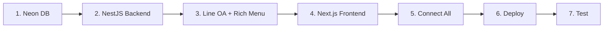

---
tags:
  - project-newclear
  - plan
  - implementation
  - phase-1
created: 2026-07-21
---

# Phase 1 Plan

> Implementation roadmap ตั้งแต่เริ่มต้นจนถึง Production

## 7 Steps Implementation



---

### 🔹 Step 1: Set up Neon Database
- สร้าง account [Neon](https://neon.tech)
- สร้าง project ได้ connection string
- Run migrations สร้างตาราง `users`, `customers`, `line_events`
- ทดสอบ query ด้วย psql หรือ Neon console

### 🔹 Step 2: NestJS Backend
```bash
nest new project-newclear-api
```
Modules ที่ต้องสร้าง:
- **LineModule** — Webhook endpoint `/api/line/webhook`
  - verify signature
  - handle postback events
  - line SDK (`@line/bot-sdk`)
- **CustomerModule** — CRUD `/api/customers`
  - create customer
  - list + search (สำหรับ dashboard)
  - get by lineUserId
- **AuthModule** — JWT login `/api/auth/login`
  - passport + JWT strategy
  - hardcode user credentials (หรือ seed DB)
- **PrismaModule** — Database ORM
  - ติดตั้ง Prisma + generate client

### 🔹 Step 3: Line OA + Rich Menu
- สร้าง Line OA ที่ LINE Developers Console
- ใช้งาน Channel Access Token + Channel Secret
- สร้าง Rich Menu via API (POST JSON → upload image → set default)
- Set webhook URL → `https://your-app.onrender.com/api/line/webhook`

### 🔹 Step 4: Next.js Frontend
```bash
npx create-next-app@latest project-newclear-web
```

| Route | Description |
|-------|-------------|
| `/register` | Registration form — receive `lineUserId` from query param |
| `/register/success` | Success page after submit |
| `/login` | Admin login form |
| `/dashboard` | Table list customers + search — ต้อง JWT |
| `/dashboard/[id]` | Customer detail page |

ดีไซน์ใช้ **Tailwind CSS** + **shadcn/ui** (free component library)

### 🔹 Step 5: Connect Components
- Form submit → `POST /api/customers`
- Dashboard → `GET /api/customers` (Bearer token)
- Line webhook → NestJS handler
- Registration success → Push API กลับไปบอก user

### 🔹 Step 6: Deploy

#### Vercel (Next.js)
```bash
vercel --prod
```
- Set environment variables: `NEXT_PUBLIC_API_URL=https://your-app.onrender.com`

#### Render (NestJS)
- Connect GitHub repo
- Build command: `npm install && npm run build`
- Start command: `npm run start:prod`
- Set environment variables: `DATABASE_URL`, `LINE_CHANNEL_SECRET`, `LINE_ACCESS_TOKEN`, `JWT_SECRET`

### 🔹 Step 7: Test Flow
- [ ] Line OA → rich menu → สั่งซื้อสินค้า → ได้ข้อความกลับ
- [ ] Line OA → rich menu → สมัครสมาชิก → ฟอร์ม → submit → DB → success
- [ ] Line ได้รับ push "สมัครสำเร็จ"
- [ ] Dashboard login → เห็นรายชื่อลูกค้า
- [ ] คลิกดู detail → ข้อมูลถูกต้อง

---

## Estimated Timeline

| Step | Duration |
|------|----------|
| 1. Neon DB | 1 วัน |
| 2. NestJS Backend | 3-4 วัน |
| 3. Line OA + Rich Menu | 1 วัน |
| 4. Next.js Frontend | 3-4 วัน |
| 5. Connect | 1 วัน |
| 6. Deploy | 1 วัน |
| 7. Test | 1 วัน |
| **รวม** | **~2 สัปดาห์** |
